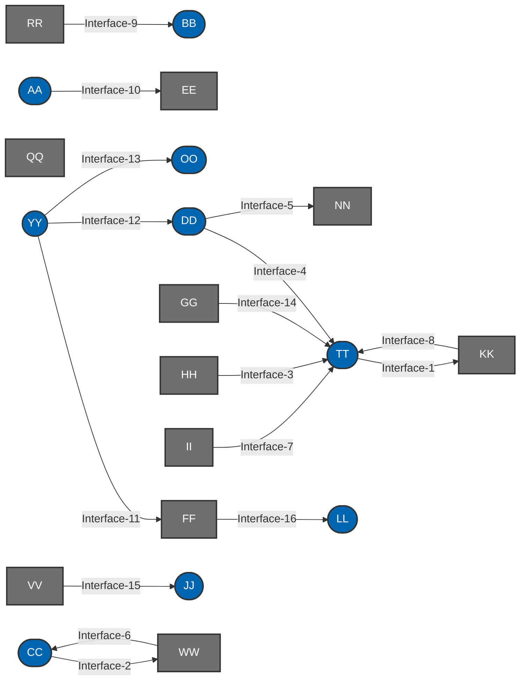

# 🚀 Overview
- **Automated IT Architecture** 
- This project is designed to automate the deployment of Information Flow diagrams using GitHub Actions.
- [Mermaid](https://mermaid.js.org/) language used for this project as **Diagram as a Code**

## 📋 Requirements
- Understanding of Mermaid language : [Tutorials](https://mermaid.js.org/ecosystem/tutorials.html)

# 🛠️ How to Run
## GitHub Actions CI/CD workflow for regular deployment
1. `workflow-main.yml` for main branch 
1. `workflow-feature.yml` for feature/* branches

## Windows PC (local) for indivisual development

1. *(Optional)* Install and Activate virtual environment
    ```sh
    python -m venv {venv_name}
    ./{venv_name}/Scripts/activate.bat
    ```

1. Install the required Python packages:
    ```sh
    pip install -r mermaid/requirements.txt
    ```

1. Run the main script:
    ```sh
    python mermaid/src/mermaid.py
    ```

## Sample Mermaid Diagram
